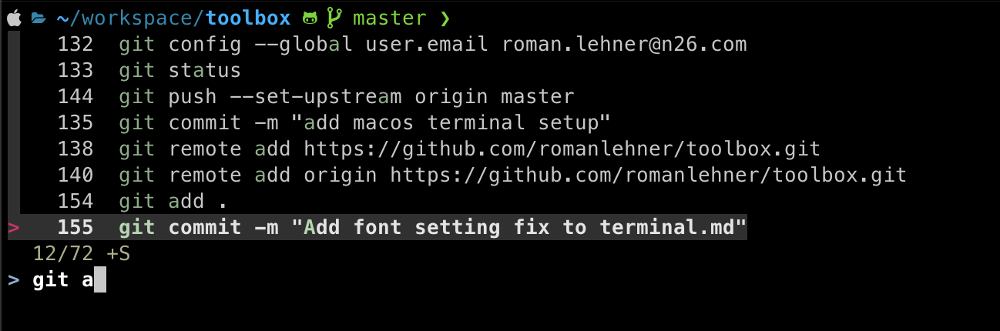

# ZSH + Powerlevel10k + Fuzzy History

## MacOS

	brew install zsh

	brew install romkatv/powerlevel10k/powerlevel10k
	echo "source $(brew --prefix)/opt/powerlevel10k/powerlevel10k.zsh-theme" >>~/.zshrc
	p10k configure

	brew install fzf
	$(brew --prefix)/opt/fzf/install	
	
Visual example:

### Visual Code
Font issues in visual code can be fixed by adding the `MesloLGS NF` font to the vscode user settings.

### Iterm2
To enable word jumps with arrow key + option:

1. Click on iTerm2 and open `Preferences`
1. Click on `Profiles`
1. Click on `Keys` tab
1. Click `Key Mappings` tab
1. Click the `Presets` dropdown and select `Natural Text Editing`
